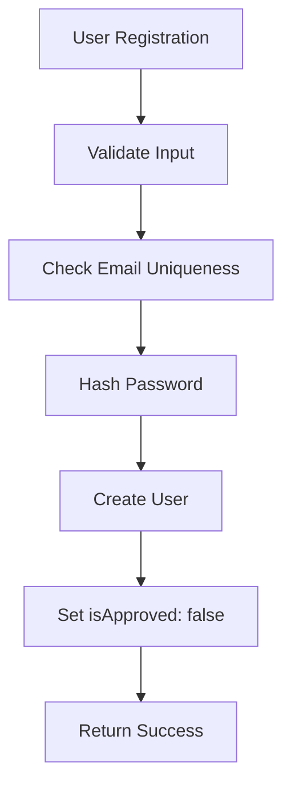
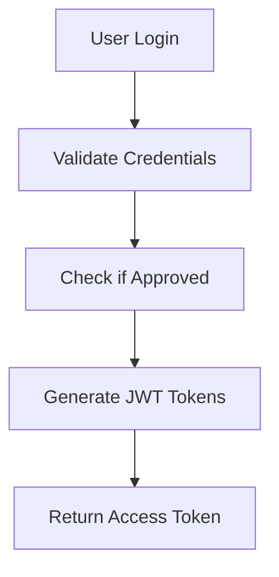
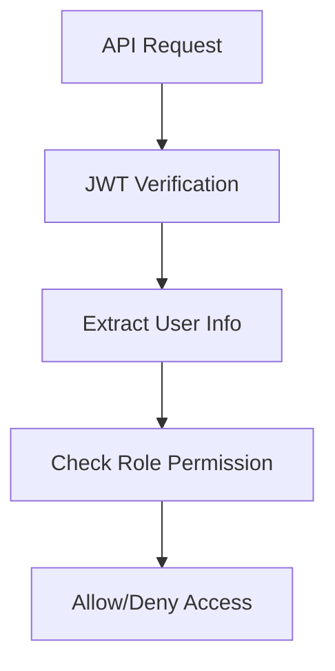
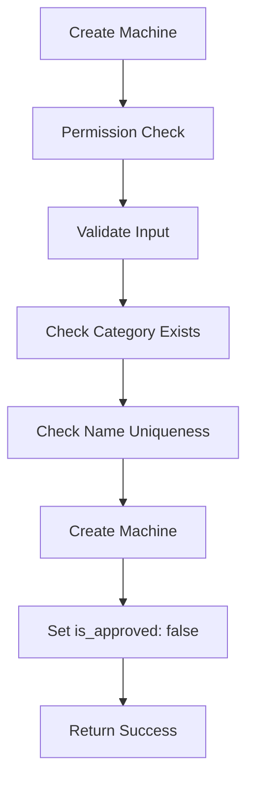
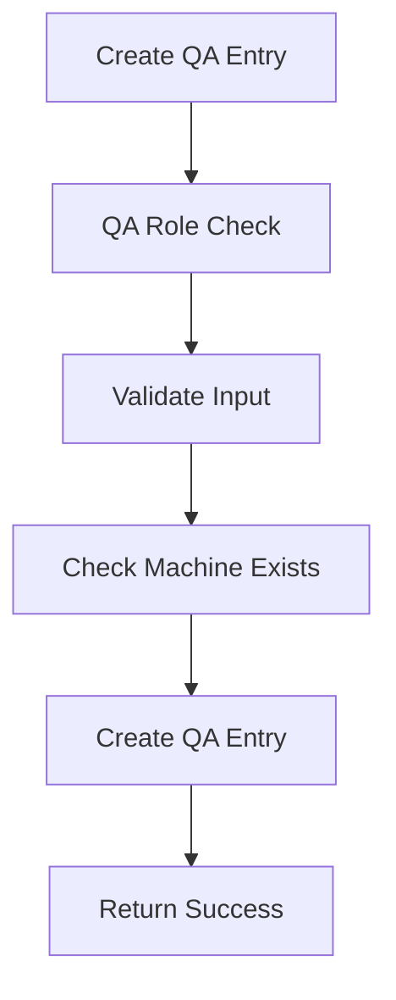
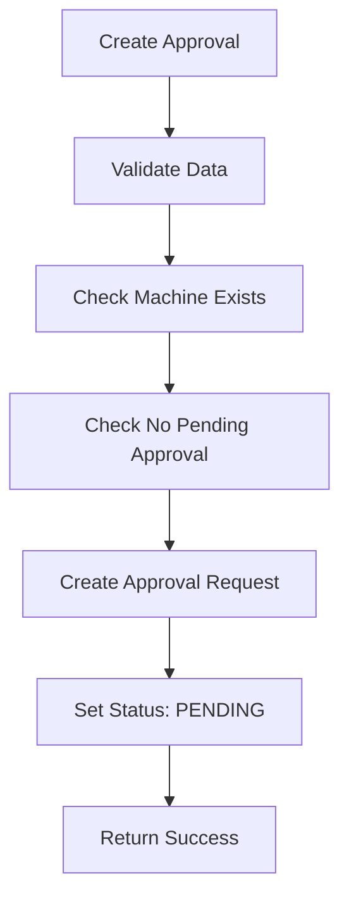
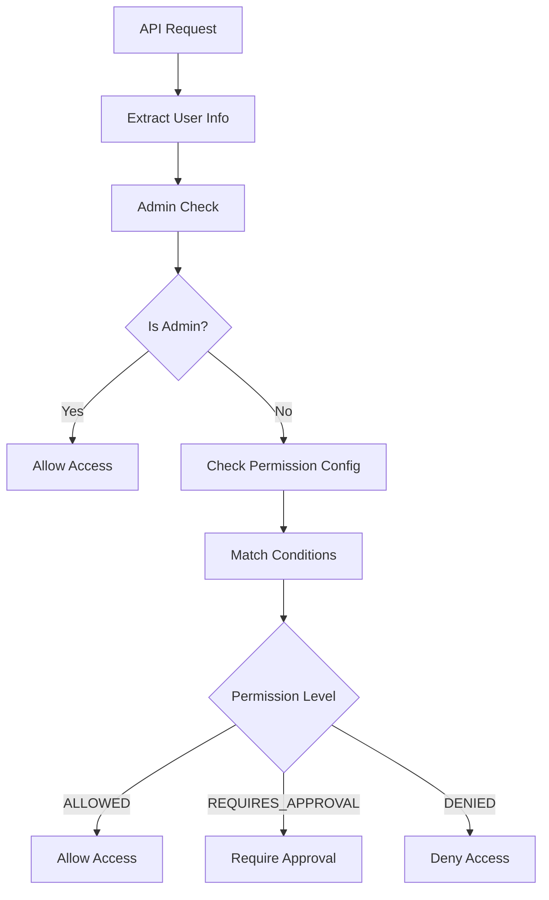

# 🚀 Machine Management System - Complete Flow Documentation

## 📋 Table of Contents
1. [System Overview](#system-overview)
2. [Database Schema](#database-schema)
3. [Authentication & Authorization Flow](#authentication--authorization-flow)
4. [User Management Flow](#user-management-flow)
5. [Machine Management Flow](#machine-management-flow)
6. [QA Machine Flow](#qa-machine-flow)
7. [Approval Workflow](#approval-workflow)
8. [Permission System Flow](#permission-system-flow)
9. [API Endpoints Summary](#api-endpoints-summary)
10. [Error Handling](#error-handling)
11. [Testing Guide](#testing-guide)

---

## 🏗️ System Overview

**Machine Management System** is a Role-Based Access Control (RBAC) system with machine approval workflows and QA management capabilities.

### 🔑 Key Components:
- **User Management**: Registration, authentication, role assignment
- **Machine Management**: CRUD operations with approval workflow
- **QA Management**: Quality assurance entries for machines
- **Permission System**: Granular permission control
- **Approval Workflow**: Multi-step approval process

---

## 🗄️ Database Schema

### Core Entities:
```typescript
User {
  _id, username, email, password, department, role, isApproved, createdBy
}

Department {
  _id, name, description
}

Role {
  _id, name, description
}

Machine {
  _id, name, category_id, created_by, is_approved, images, metadata
}

QAMachineEntry {
  _id, machine_id, added_by, report_link
}

PermissionConfig {
  _id, name, action, roleIds, permission, approverRoles, isActive
}

MachineApproval {
  _id, machineId, requestedBy, approvalType, status, approvedBy
}
```

---

## 🔐 Authentication & Authorization Flow

### 1. User Registration


**Flow:**
1. User submits registration data
2. Validator checks email format, password strength
3. Service checks if email exists
4. Password is hashed with bcrypt
5. User created with `isApproved: false`
6. Admin must approve user before login

### 2. User Login


**Flow:**
1. User submits email/password
2. Service finds user by email
3. Compares password hash
4. Checks `isApproved` status
5. Generates JWT access token
6. Returns token for API access

### 3. Role-Based Authorization


**Roles:**
- **admin**: Full access to all features
- **manager**: Can approve machines, manage users
- **engineer**: Can create machines (requires approval)
- **qa**: Can manage QA entries
- **user**: Basic access based on permissions

---

## 👥 User Management Flow

### User Registration
**Endpoint:** `POST /api/user/register`
```json
{
  "username": "john_doe",
  "email": "john@example.com",
  "password": "securePassword123",
  "department": "department_id",
  "role": "role_id"
}
```

**Flow:**
1. Validate input data
2. Check email uniqueness
3. Hash password
4. Create user with `isApproved: false`
5. Return success response

### User Approval
**Endpoint:** `PATCH /api/user/:id/approve`
**Required Role:** admin

**Flow:**
1. Admin approves user
2. Set `isApproved: true`
3. User can now login

---

## 🔧 Machine Management Flow

### 1. Machine Creation


**Endpoint:** `POST /api/machines`
**Required Permission:** `CREATE_MACHINE`

**Flow:**
1. Check user permission for machine creation
2. Validate machine data
3. Verify category exists
4. Check machine name uniqueness in category
5. Create machine with `is_approved: false`
6. Return machine data

### 2. Machine Approval
**Endpoint:** `PATCH /api/machines/:id/approval`
**Required Permission:** `APPROVE_MACHINE`

**Flow:**
1. Check user permission for approval
2. Update machine `is_approved` status
3. Set `updatedBy` field
4. Return updated machine

### 3. Machine Update
**Endpoint:** `PUT /api/machines/:id`
**Required Permission:** `EDIT_MACHINE`

**Flow:**
1. Check user permission for editing
2. Validate update data
3. Check name uniqueness (if name changed)
4. Update machine
5. Set `updatedBy` field
6. Return updated machine

### 4. Machine Deletion (Soft Delete)
**Endpoint:** `DELETE /api/machines/:id`
**Required Permission:** `DELETE_MACHINE`

**Flow:**
1. Check user permission for deletion
2. Set `deletedAt` timestamp
3. Set `isActive: false`
4. Machine is hidden from queries

---

## 🔍 QA Machine Flow

### 1. QA Entry Creation


**Endpoint:** `POST /api/qa-machines`
**Required Role:** qa

**Flow:**
1. Verify user has 'qa' role
2. Validate QA entry data
3. Check if machine exists
4. Create QA entry with user ID
5. Return QA entry with populated data

### 2. QA Entry Management
**Endpoints:**
- `GET /api/qa-machines` - List all QA entries
- `GET /api/qa-machines/:id` - Get specific QA entry
- `PUT /api/qa-machines/:id` - Update QA entry
- `DELETE /api/qa-machines/:id` - Delete QA entry
- `GET /api/qa-machines/machine/:machineId` - Get QA entries by machine
- `GET /api/qa-machines/user/:userId` - Get QA entries by user

**Flow:**
1. Verify QA role
2. Validate input/parameters
3. Perform database operation
4. Return result with populated relationships

---

## ✅ Approval Workflow

### 1. Approval Request Creation


**Endpoint:** `POST /api/machine-approvals`
**Flow:**
1. Validate approval request data
2. Check if machine exists
3. Ensure no pending approval for same machine/action
4. Create approval request with `PENDING` status
5. Return approval request

### 2. Approval Processing
**Endpoint:** `PATCH /api/machine-approvals/:id/process`
**Required Role:** admin/manager

**Flow:**
1. Verify approver role (admin/manager)
2. Validate approval decision
3. Update approval status
4. If approved: Update machine status
5. If rejected: Add rejection reason
6. Return updated approval

### 3. Approval Management
**Endpoints:**
- `GET /api/machine-approvals` - List all approvals (admin/manager)
- `GET /api/machine-approvals/pending` - List pending approvals
- `GET /api/machine-approvals/my-requests` - User's own requests
- `PATCH /api/machine-approvals/:id/cancel` - Cancel own request

---

## 🛡️ Permission System Flow

### 1. Permission Check


### 2. Permission Configuration
**Endpoint:** `POST /api/permission`
**Required Role:** admin

**Flow:**
1. Admin creates permission rule
2. Define action type (CREATE_MACHINE, EDIT_MACHINE, etc.)
3. Set conditions (roles, departments, categories)
4. Set permission level (ALLOWED, REQUIRES_APPROVAL, DENIED)
5. Set approver roles if approval required

### 3. Permission Matching
**Logic:**
1. Find active permission configs for action
2. Check if user matches conditions:
   - Role matches
   - Department matches
   - Category matches (for machine actions)
3. Apply highest priority rule
4. Return permission decision

---

## 📡 API Endpoints Summary

### User Management
| Method | Endpoint | Auth | Role | Description |
|--------|----------|------|------|-------------|
| POST | `/api/user/register` | ❌ | - | Register new user |
| POST | `/api/user/login` | ❌ | - | User login |
| POST | `/api/user/logout` | ✅ | - | User logout |
| PATCH | `/api/user/:id/approve` | ✅ | admin | Approve user |

### Machine Management
| Method | Endpoint | Auth | Permission | Description |
|--------|----------|------|------------|-------------|
| POST | `/api/machines` | ✅ | CREATE_MACHINE | Create machine |
| GET | `/api/machines` | ❌ | - | List machines |
| GET | `/api/machines/:id` | ❌ | - | Get machine |
| PUT | `/api/machines/:id` | ✅ | EDIT_MACHINE | Update machine |
| DELETE | `/api/machines/:id` | ✅ | DELETE_MACHINE | Delete machine |
| PATCH | `/api/machines/:id/approval` | ✅ | APPROVE_MACHINE | Approve machine |

### QA Management
| Method | Endpoint | Auth | Role | Description |
|--------|----------|------|------|-------------|
| POST | `/api/qa-machines` | ✅ | qa | Create QA entry |
| GET | `/api/qa-machines` | ✅ | qa | List QA entries |
| GET | `/api/qa-machines/:id` | ✅ | qa | Get QA entry |
| PUT | `/api/qa-machines/:id` | ✅ | qa | Update QA entry |
| DELETE | `/api/qa-machines/:id` | ✅ | qa | Delete QA entry |

### Approval Management
| Method | Endpoint | Auth | Role | Description |
|--------|----------|------|------|-------------|
| POST | `/api/machine-approvals` | ✅ | - | Create approval |
| GET | `/api/machine-approvals` | ✅ | admin/manager | List approvals |
| PATCH | `/api/machine-approvals/:id/process` | ✅ | admin/manager | Process approval |
| GET | `/api/machine-approvals/my-requests` | ✅ | - | My requests |

### Admin Management
| Method | Endpoint | Auth | Role | Description |
|--------|----------|------|------|-------------|
| POST | `/api/admin/departments` | ✅ | admin | Create department |
| POST | `/api/admin/roles` | ✅ | admin | Create role |
| POST | `/api/admin/category` | ✅ | admin | Create category |
| POST | `/api/permission` | ✅ | admin | Create permission |

---

## ⚠️ Error Handling

### Error Response Format
```json
{
  "success": false,
  "statusCode": 400,
  "errorCode": "VALIDATION_ERROR",
  "message": "Invalid input data",
  "errors": [
    {
      "field": "email",
      "message": "Email is required"
    }
  ]
}
```

### Common Error Codes
- `VALIDATION_ERROR`: Input validation failed
- `AUTHENTICATION_ERROR`: JWT token invalid/missing
- `AUTHORIZATION_ERROR`: Insufficient permissions
- `NOT_FOUND`: Resource not found
- `CONFLICT`: Resource already exists
- `APPROVAL_REQUIRED`: Action requires approval

### Error Handling Flow
1. **Validation Errors**: Caught by Joi validators
2. **Authentication Errors**: Caught by JWT middleware
3. **Authorization Errors**: Caught by role/permission middleware
4. **Business Logic Errors**: Caught by service layer
5. **Database Errors**: Caught by service layer
6. **Unknown Errors**: Caught by global error handler

---

## 🧪 Testing Guide

### 1. Setup Test Environment
```bash
# Install dependencies
npm install

# Set up environment variables
cp .env.example .env

# Start database
npm run dev
```

### 2. Test User Flow
```bash
# 1. Register user
POST /api/user/register
{
  "username": "testuser",
  "email": "test@example.com",
  "password": "password123",
  "department": "department_id",
  "role": "role_id"
}

# 2. Admin approves user
PATCH /api/user/:id/approve

# 3. User login
POST /api/user/login
{
  "email": "test@example.com",
  "password": "password123"
}
```

### 3. Test Machine Flow
```bash
# 1. Create machine (requires permission)
POST /api/machines
Authorization: Bearer <token>
{
  "name": "Test Machine",
  "category_id": "category_id",
  "images": ["image1.jpg"],
  "metadata": {"specs": "test specs"}
}

# 2. Approve machine (requires approval permission)
PATCH /api/machines/:id/approval
Authorization: Bearer <admin_token>
{
  "is_approved": true
}
```

### 4. Test QA Flow
```bash
# 1. Create QA entry (requires QA role)
POST /api/qa-machines
Authorization: Bearer <qa_token>
{
  "machine_id": "machine_id",
  "report_link": "https://example.com/report.pdf"
}
```

### 5. Test Permission System
```bash
# 1. Create permission config (admin only)
POST /api/permission
Authorization: Bearer <admin_token>
{
  "name": "Engineer Machine Creation",
  "action": "CREATE_MACHINE",
  "roleIds": ["engineer_role_id"],
  "permission": "REQUIRES_APPROVAL",
  "approverRoles": ["manager_role_id"]
}
```

---

## 🔧 System Configuration

### Environment Variables
```env
# Database
MONGODB_URI=mongodb://localhost:27017/machine_management

# JWT
ACCESS_TOKEN_SECRET=your_access_token_secret
REFRESH_TOKEN_SECRET=your_refresh_token_secret
ACCESS_TOKEN_EXPIRY=1d
REFRESH_TOKEN_EXPIRY=7d

# Server
PORT=3000
NODE_ENV=development
```

### Required Database Setup
1. **Create Roles**: admin, manager, engineer, qa, user
2. **Create Departments**: Engineering, QA, Management, etc.
3. **Create Categories**: Machine types
4. **Create Admin User**: First admin user for system setup
5. **Create Permission Configs**: Default permission rules

---

## 🚀 Deployment Checklist

### Pre-deployment
- [ ] All environment variables set
- [ ] Database connection tested
- [ ] All roles and departments created
- [ ] Admin user created
- [ ] Permission configs set up
- [ ] File upload directories created

### Post-deployment
- [ ] API endpoints responding
- [ ] Authentication working
- [ ] File uploads working
- [ ] Permission system tested
- [ ] Approval workflow tested
- [ ] QA system tested

---

## 📞 Support & Troubleshooting

### Common Issues
1. **JWT Token Expired**: Re-login to get new token
2. **Permission Denied**: Check user role and permission configs
3. **File Upload Failed**: Check upload directory permissions
4. **Database Connection**: Verify MongoDB connection string

### Debug Steps
1. Check server logs for error messages
2. Verify JWT token validity
3. Check user role assignments
4. Verify permission configurations
5. Test database connectivity

---

*This documentation covers the complete flow of the Machine Management System. For specific implementation details, refer to the source code comments.* 